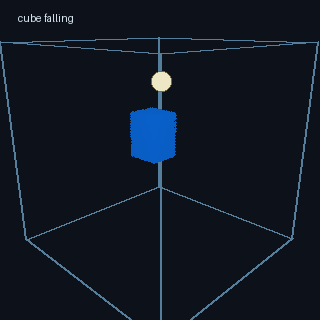
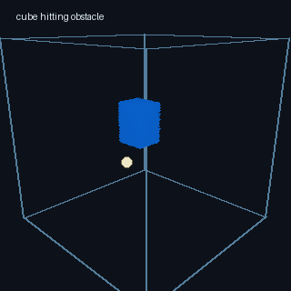
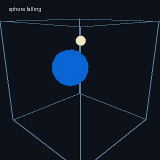
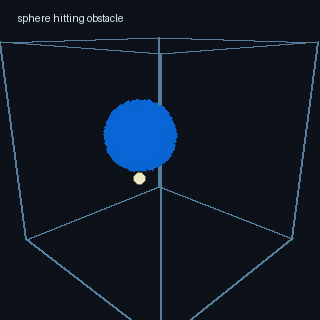
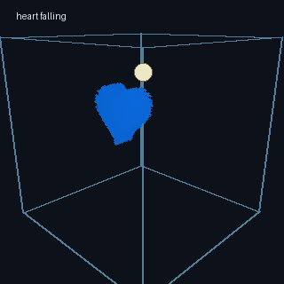
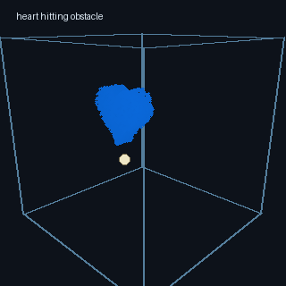
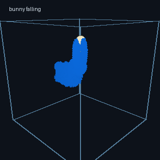
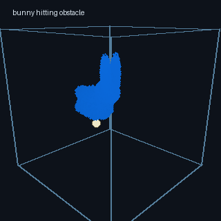

# Lab 2 FLIP Fluid Simulation 实验报告

## Lab核心实现思路

每一帧仿真按照 handout 中建议的流程组织：

```text
integrate particles
handle particle collisions
push particles apart
transfer particle velocities to grid
solve incompressibility
transfer grid velocities back to particles
update visualization colors
```

粒子积分阶段对粒子速度加入重力，再用显式欧拉更新位置。之后进行容器边界和球形障碍物碰撞处理，保证粒子不会穿出容器或进入障碍物内部。

粒子到网格的传输使用 MAC 交错网格，分别在 `u/v/w` 三组 face-centered velocity field 上进行三线性 splat。每个粒子根据自身位置把速度贡献到附近 8 个速度采样点，并使用权重归一化得到网格速度。

不可压缩求解在网格上进行。程序标记 `AIR / FLUID / SOLID` 三类 cell，对 FLUID cell 计算速度散度，并用 red-black Gauss-Seidel 迭代修正相邻 face velocity，从而降低散度。相比直接并行更新所有 cell，red-black 分组避免了相邻 cell 同时写同一个 face 带来的数值不稳定。

网格到粒子的速度回传支持 PIC/FLIP 混合：

```text
v_pic = sample(current_grid_velocity)
v_flip = old_particle_velocity + sample(current_grid_velocity - old_grid_velocity)
v_new = (1 - flipRatio) * v_pic + flipRatio * v_flip
```

因此 `flipRatio = 0` 时为 PIC，`flipRatio = 1` 时为 FLIP，默认使用 `0.95` 作为 FLIP95。

## 稳定性处理

为了提高稳定性，项目实现了粒子间距修正。粒子根据所在网格 cell 建立空间哈希，只检查相邻 cell 中的粒子，从而避免全局两两碰撞检测。若粒子距离过近，则沿连线方向做位置修正，减少粒子团聚和局部过密。

边界方面，容器壁面速度设为 0；球形障碍物既参与粒子碰撞，也在网格 solid face 上提供障碍物速度，使移动障碍物和压力投影阶段的边界条件保持一致。

## 交互与可视化

运行方式如下：

```bash
uv sync
uv run python main.py
```

Demo 使用 Taichi GGUI 渲染 3D 粒子、容器线框和球形障碍物。启动后默认处于暂停状态，可以先用鼠标放置障碍物，再按 `Space` 开始仿真。支持以下交互：

- `Space`：开始、暂停、继续仿真。
- `[` / `]`：减小或增大时间步长。
- `,` / `.`：连续调整 `flipRatio`。
- `1` / `2` / `3`：切换 PIC、FLIP95、FLIP。
- `C`：按速度、密度、压力切换粒子颜色。
- `V`：切换初始水体形状，包括 cube、sphere、heart、bunny。
- 鼠标左键：放置球形障碍物。
- 鼠标右键：旋转相机。
- `Q` / `E`：缩放视角。
- `R`：重置当前场景。

## Demo 结果

下面展示四种初始水体形状。每种形状包含两个结果：正常下落，以及下落过程中碰到球形障碍物。

### Cube

正常下落：



碰到障碍物：



### Sphere

正常下落：



碰到障碍物：



### Heart

正常下落：



碰到障碍物：



### Bunny

正常下落：



碰到障碍物：




